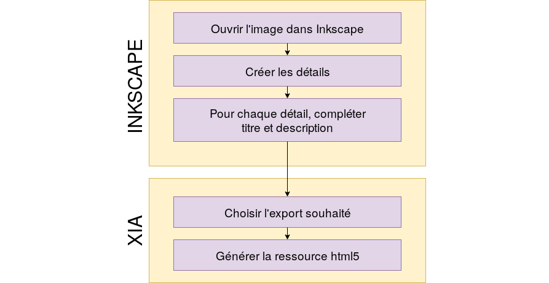
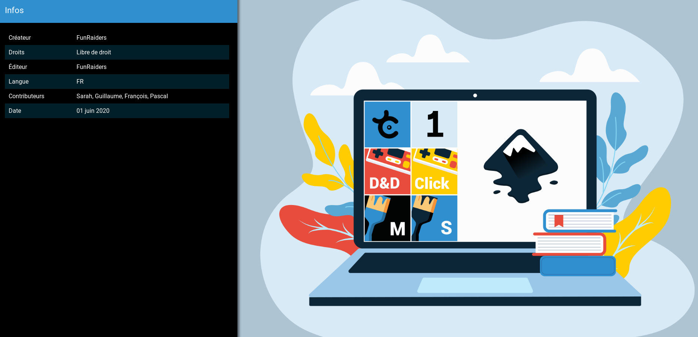
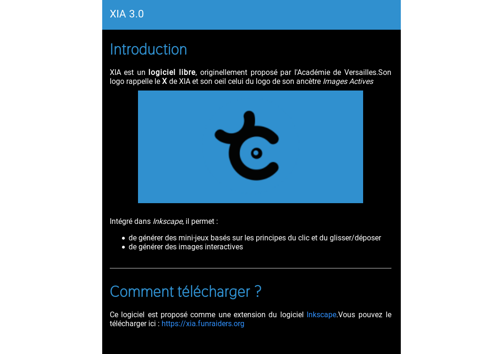
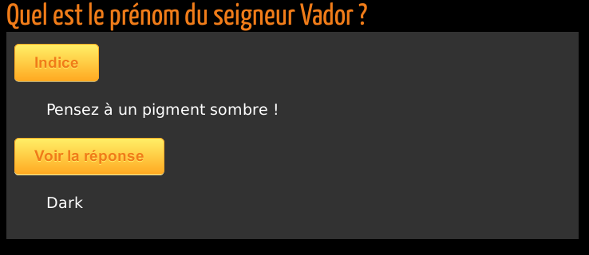

# XIA User manual

## 1. Presentation<a name="presentation"></a>

### 1.1. What is XIA? <a name="quest-ce-que-xia"></a>

Xia is a free software under GPL license [GPLv3](http://www.gnu.org/copyleft/gpl.html). This tool transforms svg file into html5 interactive resource. You can generate games and insteractive activities: Drag and drop games, selection, discrimination, etc.

First parts of this documentation (see part [II](#creation-dune-premiere-image-interactive)) explain how to realize simple interactive image: clipped details and text without any format. Next, you will learn how to create more complex interactive images (see part [III](#images-interactives-enrichies)).


### 1.2. General process <a name="processus-general"></a>

Xia is needed only at the end of the process. As you can see on the next schema, the main job is done using a third part software dedicated to vectorial drawing. We suggest using the multi-platform software [Inkscape](http://www.inkscape.org/).



### 1.3. Installation <a name="installer-inkscape-et-xia"></a>

You only have to install Inkscape and XIA to follow this article. Install Inkscape using this documentation https://inkscape.org/fr/telecharger/.

Be aware to install Inkscape before XIA.

## 2. Creating your first interactive image <a name='creation-dune-premiere-image-interactive'></a>

### 2.1. Creating the resource <a name='creation-ressource-support'></a>

First, you have to choose your background image and open it with Inkscape `> File > Open`  

When asked, choose **Incorporate image**.

Informations filled in **document metadata** (menu `>File >Document properties >metadata`) will be saved in generated resource : title, creator, rights, etc. Theses data are rendered like this :




The title entered in the document metadata appears above the interactive image and gives its name to the web page displaying it. The creator and the associated rights appear in the pop-up accessible via the **i** icon located to the right of the title of the interactive image.

You can save your project in svg format as soon as you start working, by going to the menu `> File> Save`.

For clarity, you can remove the original extension from your image in the ** Name ** field of the dialog window. Finally, from the drop-down menu, choose the Inkscape svg file format: ** SVG Inkscape (.svg) **

There are many tools in Inkscape that can be used to clip the details that will become active in the animation generated by Xia. Among these:


- Create rectangles and squares
- Create circles, ellipses and arcs
- Draw lines freehand
- Draw Bézier curves and line segments

Without going into the details of how these different tools work (For that, read the [inkscape manual] (http://inkscape.org/doc/shapes/tutorial-shapes.fr.html) or the [Floss manual] (http://en.flossmanuals.net/inkscape/))), be aware that the tool **Draw Bézier curves and line segments** allows you to clip "click by click" (the construction points of the polygon are then called “**nodes**”). You can close your polygon by clicking on the first node of this same polygon. You can draw **Bezier Curves** by holding down your mouse click after creating a node, then moving the cursor to bring up the control handles to change the shape of the curve.


>If you leave a shape open in Inkscape (a curve for example), Xia will automatically close it by joining its start and end point. The z-index of details created in Inkscape will be the same in the interactive image.

Once the details are cropped (The color of the outline of the details in the animation generated by Xia will be the same as the one chosen in Inkscape), you can select them with the **Select and transform objects** tool in order to resize them , move them, etc.

You can access the **Object properties** by right-clicking on the cropped detail. From there, you access a dialog window allowing you to add the text that will be associated with the detail in the interactive image:


The two fields that must necessarily be filled in this window are the **Title** and **Description** fields. The title will become that of the detail, the description its comment. Don't forget to click on the **Define** button before closing the **Object Properties** window.

The process described above should also be done with the background image: the title and description of it will serve as a general introduction to the interactive image (this is a title and a comment which are not related to a particular detail).


> If you have difficulty selecting a detail that you have clipped, apply a background color to it. Any color will do the job, except black and white (we'll see why later).

### 2.2. Generation of the interactive image with Xia <a name='generation-image-interactive'></a>


When all the details are cut out and their metadata filled in, Xia can be launched by clicking on `> Extensions> Export> Xia`.


Choose an export template and a directory to save the interactive image.

By clicking on *Apply*, you generate an `html` file. Double click on it to open it in your browser to see your interactive image in html5 format.


>The generated resource requires internet access to fully work.


### 2.3. expert usage ! <a name='export-ligne-de-commande'></a>

You can generate your html5 animations using the `terminal` with the **xia** command. The parameters to use are **--input** to indicate the input file, **--output** to indicate the export directory, **--theme** to indicate the chosen theme.


**With GNU/Linux**, for a single file export using the accordionBlack theme:

```
xia --input myfile.svg --output ~/export --theme sidebar --export singlefile
```

**With Mac OS X**, for an export usable without an internet connection, using the gameDragAndDrop theme:

```
cd /Applications/xia.app/Contents/Resources/
python3 xia.py --input myfile.svg --output ~/export --theme gameDragAndDrop --export local
```

**With Windows**, to export a single file using the sidebar theme, you must use the XIA portable version tool (downloadable from the XIA site). Once the zip archive has been unzipped, (suppose you did it in xia-windows), you must edit the file `xia-windows/xia/xia.bat` as follows:


Then double-click on the `xia.bat` file to start the export.

<a name='enriched_ia'></a>

## 3. Enriched interactive images <a name='images-interactives-enrichies'></a>

In this section, the main goal remains the creation of a "**simple**" interactive image (in other words, in which a detail shows a comment). However, details comments will be enriched with formatting and insertion of multimedia resources.

### 3.1. Text formatting (wiki engine) <a name='mise-en-forme-du-texte'></a>

To enrich the text and provide multimedia resources, XIA relies on a basic wiki syntax. As you can see by comparing the two screenshots below, just add specific **markers** in the text to do the formatting or just write the links to the resources to integrate.


Text entered with wiki markers:

```
# Introduction

XIA is **free software**, originally created by the public school academy of Versailles.
Its logo is reminiscent of XIA's **X** and its eye that of its ancestor's logo *Image Active*
https://xia.funraiders.org/img/xia-long.png

Integrated into *Inkscape*, it allows:
 * mini-games creation based on the principles of single click and drag&drop
 * interactive images creation

----

# How to download it?

This software is available as an extension of the software [https://inkscape.org/en Inkscape].
You can download it here: https://xia.funraiders.org

```

Final rendering:



#### Wiki syntax and resources integration.

- `**bold**`
- `*italic*`
- `# title level 1`, `## title level 2` ... (this is the ***markdown*** syntax, we can go further until level 6)
- `{{{write text without formatting}}}`
- To insert an image that is on the internet, simply write the link to this image:
```
https://xia.funraiders.org/img/xia.png
```
- To insert an image that is next to the XIA resource you generated, use the relative paths syntax (the `.` means` next to` and the `..` means` move up to parent` ):
```
./my_image.jpeg
images/mon_autre_image.jpeg
../images/my_image.png
```
- To create hyperlink to the XIA site, simply enter the url:
```
https://xia.funraiders.org
```
- To create hyperlink on a word or an expression:
```
[https://xia.funraiders.org XIA WEBSITE]
```
- To create hyperlink on an email address, simply enter the email address:
```
xia@framalistes.org
```

- Use a bulleted list (*** Place a space in front of each asterisk ***):
```
 * item 1
 * item 2
   * item 2-1
   * item 2-2
```

### 3.2. Insert multimedia resources in comments <a name='inserer-ressources-multimedia'> </a>

#### 3.2.1. Use a local resource <a name='ressource-multimedia-locale'> </a>

Inserting multimedia resources in comments is quite easy: copy and paste the url of the resource (whether absolute or relative) or the iframe code of the web service used to host your resource, and Xia will automatically create a multimedia player, as long as it (image, sound, video) is one of the supported formats:

- **[Images]**: jpg, jpeg, png, gif
- **[Audio]**: ogg, mp3
- **[Video]**: ogv, webm, mp4

The link must be inserted in the `Description` field of the` Object properties`.


- **[Absolute link]**: If the url of the resource is `http://web.crdp.ac-versailles.fr/02546.ogg`, then all you have to do is write this url in the field `Description` of `Object properties` in Inkscape.

- **[Relative link]**: If the multimedia resource file is in the interactive image export directory, or in a directory contained in it, simply indicate the path to the file, in considering the export directory as the root directory. For example, if the `video.ogv` file is in the` videos` directory which is itself in the interactive image directory, specify:

```
./videos/video.ogv
```

to create the media player.


>The video formats supported by Xia are not supported by all web browsers. It is therefore recommended to export the videos in the 2 supported formats (mp4 and webm), and to upload them in the same directory. Thus, even if a specific format is indicated in the description (if we follow the previous example: `videos/video.mp4`), if the browser is unable to read the resource, it will automatically try to play files with the same name but with a different extension (that is, `video.mp4` and` video.webm`).

#### 3.2.2. Iframe usage<a name='ressource-multimedia-iframe'></a>

Another method is to insert an `iframe` code. This will be interpreted and the web service reader will appear, giving access to the resource.


#### 3.2.3. Oembed usage<a name='ressource-multimedia-oembed'></a>

The last method, the simplest of all, allows you to insert resources using the `oembed` technology. Currently, XIA knows how to manage the following external services:

- **Flickr**: Use their sharing system directly, for example `https://flic.kr/p/jZ2A12`
- **Scolawebtv** (service of the Academy of Versailles): Directly use their oembed links such as for example `https://scolawebtv.crdp-versailles.fr/?Id=3740`
- **WebTv** (service of the Academy of Versailles): Use their oembed links directly, for example `http://webtv.ac-versailles.fr/spip.php?Article1205`

#### 3.2.4. Hint : Create background music or a sound description<a name='ressource-multimedia-ambiance'></a>

XIA is able to play soundtracks on demand. Suppose you want to add a soundtrack that explains the resource offered when it is launched. For the example, suppose you saved your comment in the `comment.mp3` file. You just need to write the following line in the **description of the background image**:

```
./commentaire.mp3 autostart
```
The `.` means that the file is local (located right next to your xia resource) and the `autostart` means that XIA should start the resource immediately without specific user action.


### 3.3. Insert images in your interactive image<a name='inserer-des-images'></a>

#### 3.3.1. Background image <a name='image-de-fond-composite'></a>

After making your interactive image, you realize that there are elements missing in your background image. Note that you can add other images a posteriori and thus group them with the background image to form a composite background image. To do that :

- Select `>File>Import` in Inkscape to embed your new image.
- Select your background image and your new image at the same time (Use the `Shift` key for multiple selection)
- Group these two selected elements by going to the menu `>Objects>Group`


#### 3.3.2. Selectable image <a name='image-selectionnable'></a>

Sometimes you need to add comments on your image that are not related to a detail. A simple method is to add an image to your publication. By default, this image will only be visible on hover. If you want to make it persistent, you just have to resort to a trick: apply a white background color to this image.
The imported image will only appear in the html5 animation on one condition: that you have applied a white background to it in Inkscape. Choose the color white in the horizontal palette at the bottom of the Inkscape interface:


By indicating an url in the `Title` field of the `Object properties`, this embedded image will become a clickable link.

### 3.4. Show a question / hint and reveal an answer <a name='question-reponse'></a>

You can create a clickable icon, which temporarily prevents a user from reading the comment. You can even ask the user to enter a password to read the comment.

To do this, use the following syntax:

```
TITLE: What is the first name of Lord Vader?
```

```
DESCRIPTION:

[[Hint: Think of a Dark pigment!]]

[[See answer: Dark]]
```

Here is the result:


If you click on the buttons, this is the result:



To make things more difficult, you can also use a code to lock the buttons as follows. Suppose you want to deny access to the index with the code `security`:

```
TITLE: What is the first name of Lord Vader?
```


```
DESCRIPTION:

[[Hint (code = security): Think of a Dark pigment!]]

[[Give the answer (code = Dark): Well done!]]
```
As soon as the student clicks on the `Hint` button, an input field will appear to allow him to enter the security code. Likewise, when he clicks on the `Give the answer` button, he will have to type the word `Dark` to reveal the success message. Note that the latter usage is a workaround of the original functionality.


>elements `[[..]]` can be nested.


### 3.5. Control the behavior of details: immediate display and deactivation <a name='comportement-details'></a>

By default, the behavior of details of an interactive image is as follows:
- highlighting of details when hovering the mouse or by clicking on its title in the comments,
- zoom effect during a second click on the active detail.

These two default behaviors can be changed if you apply a black or white background to the clipped details:

- **[Detail with a white background]** In the interactive image, these details will be visible immediately, in the form of an opaque solid color, hiding the background image; once selected, this background will be visible (the zoom remains active).
- **[Detail with black background]** Users will need to click to enable detail, but the zoom effect is disabled.

Logical consequence: as a detail cannot simultaneously have a black background and a white background, a detail cannot be both immediately visible and have the zoom disabled.


### 3.6. Summarize <a name='resume-images-enrichies'></a>

- You can enrich and format the text using tags
- Multimedia enrichment is possible by simple link (relative or absolute) to a file whose format is recognized by Xia
- We add images on the background image by incorporating them and applying a white background.
- You can change the default behavior of details by applying a background color (white or black)
- The order of the details of the interactive image depends on the order of their creation in Inkscape. However, we can use the Inkscape XML editor to modify this order.
- It is possible to prevent users from accessing the comment by inserting a clickable icon and / or a password


## 4. FAQ <a name='faq'></a>

### I can't see Xia in the Inkscape extensions menu. Why?

#### Installation order
Did you install Inkscape before Xia? If not, re-install Xia. If you are using the portable version of Xia, the fact that nothing appears in the extension menu is quite normal.

#### 32-bit vs 64-bit Inkscape
By default, XIA installs for 64-bit Inkscape. If you have installed the 32-bit version, the easiest way is to uninstall it, install the 64-bit version and reinstall XIA behind.

### The "Source file" icon does not appear when I launch Xia from the Inkscape extension menu. Why?

When launching Xia from Inkscape extensions, there is no “~Source file~” icon, since Xia considers that the html5 animation you want to generate is the one you are working on in Inkscape ... therefore only the export options and the model.

### I installed Inkscape but I can't find it in my programs. Where is he hiding?
Xia can be found in the Mac OS X “~Applications~” folder. On a GNU/Linux system, the Xia package is named “~xia-converter~”. On Windows, Xia only works as an extension of Inkscape. If you want to use the software alone, use the portable version.

### I added some text to my image with the "~ Create and edit text objects ~" tool, but I don't see it appear in my interactive image. Why?

If you do not make a bitmap copy of the text, Xia will consider that the text created with the "~Create and edit text objects~" tool is a detail, and not an image to display.

## 5. Inkscape Hints <a name='astuces'></a>

- Add background colors to your details. This will make the details easier to select and edit, and it won't affect the html5 animation (unless you choose white or black as the fill color).
- If you want to create a detail from several details, you can ** "Group" ** them.
- When a detail is created, it is always possible to modify it: adding or removing nodes, moving, etc. Just double-click on a detail and use the modification tools
- If you are creating your interactive image only with Inkscape's drawing tools (making bitmap copies of imported shapes or images), we strongly recommend that you group all objects (including the background image), to make a bitmap copy of this set, and use this bitmap copy as the background image. If you do not do this, some images or bitmap copies may disappear in the interactive image when details above them are selected (which is
logical: the main role of a detail is to allow the user to see what is on the background image).

